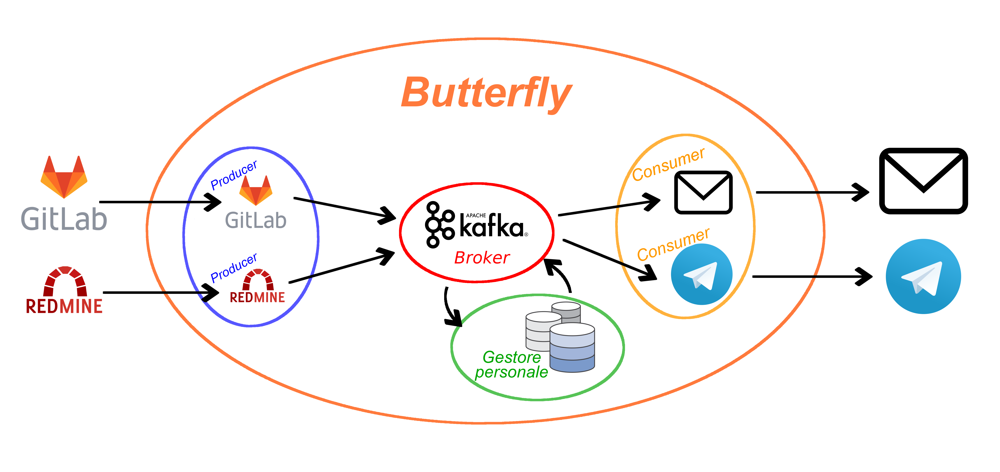

# Butterfly

**Butterfly** è un software che permette la configurazione dell'inoltro dei messaggi da parte di **Redmine** e **Gitlab** agli utenti tramite **Telegram** ed **Email**, passando per il Broker **Apache Kafka** che comunica con un **Gestore Personale** che contiene tutte le preferenze degli utenti e quindi la logica degli inoltri. Questo prodotto è stato sviluppato come progetto di gruppo per il progetto della materia **Ingegneria del Software** dell'Anno Accademico 2018/2019 dei professori [Tullio Vardanega](https://www.math.unipd.it/~tullio/) e [Riccardo Cardin](https://www.math.unipd.it/~rcardin/).
Il gruppo che lo ha sviluppato si chiama **AlphaSix** ed è composto da:
- [Ciprian Voinea](https://www.linkedin.com/in/cvoinea/)
- [Timoty Granziero]()
- [Laura Cameran](mailto:lauracameran@gmail.com)
- [Samuele Gardin](www.linkedin.com/in/samuele-gardin)
- [Matteo Marchiori](www.linkedin.com/in/matteo-marchiori-882143bb)
- [Nicola Carlesso](mailto:nicolacarlesso@outlook.it)

La figura proponente di questo progetto è [Imola Informatica](https://www.imolainformatica.it/home/) che ha fornito il seguente capitolato che descrive i requisiti richiesti per il Butterfly:
- [capitolato fornito](http://www.math.unipd.it/~tullio/IS-1/2018/Progetto/C1.pdf)
- [slide di presentazione](https://www.math.unipd.it/~tullio/IS-1/2018/Progetto/C1p.pdf)

Butterfly utilizza l'architettura **Publisher Subscriber** ed è stato pensato in maniera da suddividerlo in più sottosistemi: quello dei Producer, dei Consumer, del Gestore Personale e del Broker.

# Docker e Rancher
Sotto richiesta dell'azienda proponente, Butterfly è stato sviluppato in maniera tale che funzioni su container **Docker** e la loro istanziazione venga fatta tramite un gestore di oggetti Kubernetes come **Rancher**. Il seguente README fa riferimento ad un sistema nel quale questi due sono correttamente installati e configurati.

## DockerHub:

Le immagini di Docker corrispondenti ai vari container sono presenti anche su **[DockerHub](https://hub.docker.com/u/alphasix)** dove sono state configurate le **Automated Builds** sul branch master.

**Producer GitLab** :   

**Producer Redmine** :   

**Consumer telegram** :   

**Consumer mail** :   

**Gestore Personale Client** :   

**Gestore Personale** :   

## Istanziazione dei container su Rancher
Abbiamo sviluppato i **Dockerfile** in maniera tale da suddividere il progetto in 6 container:
- **[Producer](./Butterfly/producer/)**: GitLab e Redmine
- **[Consumer](./Butterfly/consumer/)**: Telegram e Email
- **[Gestore Personale](./Butterfly/consumer/)**: un client e un controller

Questi vengono descritti in particolare nelle rispettive cartelle in cui è anche contenuto il codice oltre che nei documenti prodotta insieme al software.

Su Rancher abbiamo pensato di suddividere un nodo che ci è stato fornito dall'azienda come ambiente di lavoro in maniera tale che ci fossero i seguenti namespace:
- **producer** : con istanziati i container dei producer
- **consumer** : con istanziati i container dei consumer
- **gestore-personale** : con istanziati i container del gestore personale e MongoDB presente su [DockerHub](https://hub.docker.com/_/mongo)
- **kafka** : con istanziato il container di Kafka presente nello store di container scaricabili in  Rancher
- **gitlab** : con istanziato il container di GitLab presente nel [DockerHub](https://hub.docker.com/r/gitlab/gitlab-ce/)
- **redmine** : con istanziato i container di Redmine e Postgress presenti nel [DockerHub](https://hub.docker.com/_/redmine)

Nel container di Redmine è necessario installare correttamente il plugin relativo all'[invio dei webhook](https://github.com/suer/redmine_webhook).
È possibile configurare ciascun componente del prodotto tramite file di configurazione oppure variabili di ambiente (le seconde hanno la priorità) descritte per ciascuno dei servizi.

Per vedere l'installazione e la configurazione che è stata effettuata per la proponente vi rimandiamo ai documenti Manuale Utente e Manuale Sviluppatore rilasciati insieme al prodotto.
